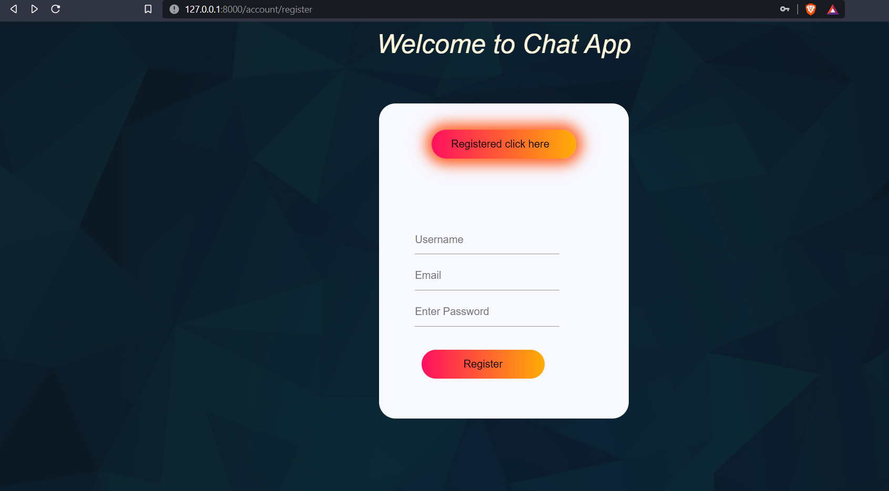
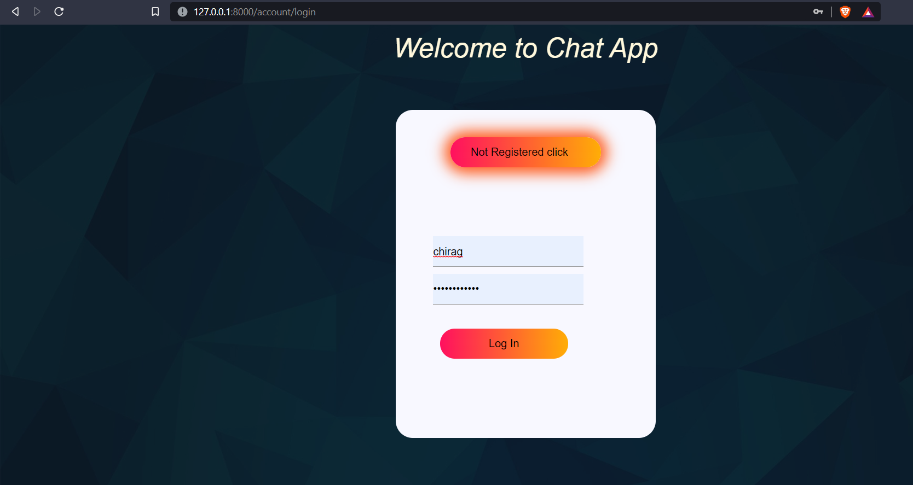
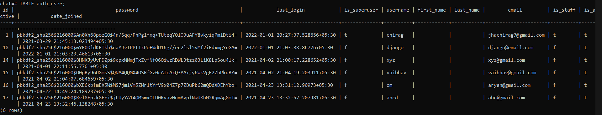
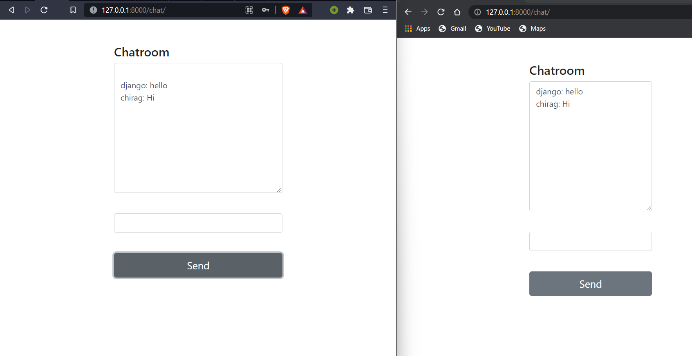

# chat-Application

## Register Page:
1) Once the user enter localhost/account/register register page loads where user can register and user data is stored in the postgresql database as in below:

## Login Page:
1) if the url conatins localhost/account/login login page loads where the verification of users beign done before going tho the chat window:

## Postgress Database:

## Chat Room:
1) if url contains localhost/chat/<str> chat pages load where multiple registered users can chat simultaneously through websockets.
2) chat room conatains textArea, input text and send button
3) At loading we fetch the user from the database with **{{ request.user.username|json_script:"user-name"}}** 
4) Channel used for communication is redis.
5) Through routing re path it as ws(websocket)/chat/<str> and asgi wrapper of consummers for each connection
6) ChatConsumers have async 4 functions **connect(for connecting to the specified room)**,**disconnect(disconnect from the room)**,**receive(receive message from websockets and send to room group)**,**chat_message(receive from room group and send to websocket to deisplay to text area)**

